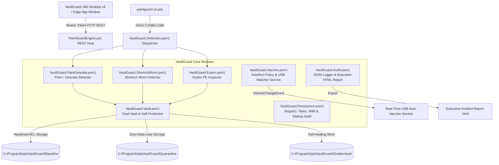

# 🛡️ VaultGuard 360 Antivirus & Vaccine Suite
*Created by Klyvex Studios - Version v1.0.0*

[](LICENSE)
[](#architecture-overview)
[](#architecture-overview)
[](#architecture-overview)
[](#-native-desktop-application--installer-build-guide)

**VaultGuard 360** (v1.0.0) is a complete, enterprise-grade incident response, clean-file integrity vault, self-protecting immunity engine, and multi-family antivirus suite engineered by **Klyvex Studios** to neutralize removable media malware and PE file infectors.

### 🌟 Complete Feature Matrix
- **Native Desktop Window & System Tray Host (`VaultGuard360.exe`)**: Compiled C#/.NET desktop host featuring single-instance Mutex guard, system tray context controls, and auto-start management.
- **Real-Time Animated Threat Popups**: Desktop Toast & Popup notifications when threats are detected or quarantined by the real-time engine.
- **Multi-Family Antivirus Engine**:
  1. **Paint / Geacata Family**: Twin-pair file replacement worm ($v\text{<name>} + \text{<name>}$, 844,288 B signature).
  2. **Shortcut Worm Family** (`Vobfus`, `Dorkbot`, `Gamarue`): Corroborated `desktop.ini` `SHELL32.dll,7` drive icon hijacks, `.lnk` shortcut traps, and hidden folder recovery.
  3. **Expiro PE Infector Family** (`Win32/Expiro`): PE Header structural section appender inspection with a 4-rung remediation ladder.
- **Dual-Compartment Vault**: Hardened `Baseline\` (clean binary blob store) and `Quarantine\` (isolated malware payload store).
- **USB Watchdog & Immunization**: Real-time `Win32_VolumeChangeEvent` monitoring with AutoRun policy hardening and FAT32/NTFS trap deployment.
- **Inno Setup Builder (`setup.iss`)**: Automatic installer compiler creating single-click `VaultGuard360_Setup.exe`.

---

## 📐 Architecture Overview



---

## 🔥 Key Security Features

### 1. 🏰 Dual-Compartment Vault Architecture
Maintains two distinct, ACL-hardened repositories under `C:\ProgramData\VaultGuard\`:
- **`Baseline\` Compartment**: Stores deduplicated clean binary blobs (`blobs\<SHA256>.exe`), `manifest.json`, and `vault.sig`. Provides byte-perfect restoration without risking PE reconstruction corruption.
- **`Quarantine\` Compartment**: Holds isolated threat payloads (`{GUID}.bin`) and sidecar metadata (`{GUID}.json`) recording original path, SHA-256 hash, timestamps, and detection reason.

### 2. 🛡️ Antivirus Self-Protection & Golden Vault Immunity
- **ACL Hardening**: Strips inherited permissions, grants Full Control strictly to `SYSTEM` and `Administrators`, and explicitly denies `Everyone` (Read/Write/Delete/List) on `C:\ProgramData\VaultGuard\`.
- **Golden Module Store**: Maintains signed module templates inside `GoldenVault\` for watchdog self-healing against userland tampering.
- **UAC Elevation Boundaries**: *Note: Userland self-protection holds against non-elevated user-token malware under default Windows UAC. Administrative-token malware requires system-level kernel drivers.*

### 3. 🪜 4-Rung Expiro Remediation Ladder
Expiro (`Win32/Expiro`) appends malicious sections to executables and encrypts relocations. VaultGuard 360 uses a 4-rung remediation ladder:
1. **Rung 1 (Kill Verified Process)**: Terminates running infected processes by CIM `ExecutablePath` + SHA-256 hash match.
2. **Rung 2 (Vault Blob Restore)**: Restores byte-perfect clean binary from `blobs\<hash>.exe` if captured in baseline.
3. **Rung 3 (SFC / DISM Delegation)**: If an OS binary under `C:\Windows\System32\` is infected, quarantines payload and delegates repair to `SFC /scannow` / `DISM`.
4. **Rung 4 (Unrecoverable Alert)**: Flags non-baseline executables for clean reinstall from original source.

> [!NOTE]
> **Expiro v1 Scope**: VaultGuard 360 v1 enforces Clean-File Vault Restore and SFC/DISM delegation rather than in-place PE reconstruction, protecting against the 2017 relocation-encrypting variant. In-place reconstruction is deferred to v2 behind a VM-verification gate.

### 4. 👁️ Real-Time USB Watcher & Vaccine Guard
- **Persistent Service Watcher**: Registers a `Win32_VolumeChangeEvent` event sink hosted by `Start-VaultGuardService` managed by `Start-PaintGuard.ps1` with mutex locking (`Global\VaultGuard_SingleInstance_Mutex`).
- **AutoRun Policy Hardening**: Configures `NoDriveTypeAutoRun = 0xFF` to block autorun execution.
- **FAT32 & NTFS Traps**: Deploys empty `autorun.inf` directory traps on FAT32 media and NTFS ACL `Deny Write`/`Deny Delete` traps.

### 5. 🔍 Corroborated Heuristics & Three-Tier Verdicts
- **Three-Tier Verdict Engine**: Classifies targets as `Clean | Suspicious | Infected`. Only `Infected` items are auto-remediated; `Suspicious` items are routed to a SysAdmin Review Queue.
- **Corroborated Shortcut Worm Detection**: `desktop.ini` folder icon swaps (`SHELL32.dll,7`) are ONLY flagged when corroborated by `.lnk` shortcut flood ratios and hidden user directories. Legitimate system folders (`System Volume Information`, `$RECYCLE.BIN`, `System Recovery`) are strictly whitelisted.
- **`-WhatIf` / `-DryRun` Mode**: Supported across all detectors, CLI, and REST API (`/api/scan?dryrun=true`) to preview remediation actions without modifying disk files.

---

## 🚀 Quick Start Guide

### Option 1: Launch Desktop App UI (Recommended)
Right-click `Start-PaintGuard.ps1` and select **Run with PowerShell** (or run from an elevated shell):

```powershell
.\Start-PaintGuard.ps1
```

---

### Option 2: SysAdmin CLI (`paintguard-cli.ps1`)
For recovery shells, headless servers, or automated scripts:

```powershell
# Preview threat scan findings without modifying files (Dry-Run)
.\paintguard-cli.ps1 -Scan -Drive C:\ -DryRun

# Scan network share
.\paintguard-cli.ps1 -Scan -ScanShare \\server\share

# Snapshot clean system baseline into vault
.\paintguard-cli.ps1 -CaptureBaseline

# Verify disk files against Vault manifest
.\paintguard-cli.ps1 -VerifyIntegrity

# Export baseline vault to an offline USB drive
.\paintguard-cli.ps1 -ExportBaselinePath D:\VaultGuardVault

# Start real-time USB VolumeChangeEvent watcher
.\paintguard-cli.ps1 -StartWatchdog

# Administer system vaccine and AutoRun hardening
.\paintguard-cli.ps1 -EnableVaccine
```

---

## 🔌 Hardened REST API Reference

All REST API endpoints bind strictly to loopback (`127.0.0.1`) and require the `Authorization: Bearer <token>` header.

| Endpoint | Method | Description |
| :--- | :---: | :--- |
| `/api/status` | `GET` | Returns REST engine health, quarantine count, vaccine status, and USB watcher state |
| `/api/scan` | `POST` | Dispatches drive/share scan job (`{ Paths: ["C:\\"], ScanShare: "\\\\host\\share", DryRun: true }`) |
| `/api/jobs/{id}` | `GET` | Queries progress telemetry and scan results for job `{id}` |
| `/api/baseline/capture` | `POST` | Snapshots clean system executables into baseline vault |
| `/api/baseline/verify` | `GET` | Verifies disk files against baseline vault manifest |
| `/api/baseline/restore` | `POST` | Restores clean binary from vault via layered sequence |
| `/api/baseline/export` | `POST` | Exports baseline vault to offline USB media (`{ DestinationPath: "..." }`) |
| `/api/baseline/import` | `POST` | Imports offline baseline vault (`{ SourceVaultPath: "..." }`) |
| `/api/watchdog/start` | `POST` | Starts real-time USB `Win32_VolumeChangeEvent` watcher service |
| `/api/watchdog/stop` | `POST` | Stops USB watcher service |
| `/api/quarantine` | `POST` | Moves specified threat file to Quarantine Vault |
| `/api/quarantine/vault` | `GET` | Retrieves catalog of items in Quarantine Vault |
| `/api/quarantine/restore` | `POST` | Restores quarantined item from vault by `{ QuarantineId: "..." }` |
| `/api/quarantine/purge` | `POST` | Permanently purges payload from vault by `{ QuarantineId: "..." }` |
| `/api/persistence` | `GET` | Performs comprehensive persistence audit |
| `/api/persistence/repair` | `POST` | Repairs malicious registry keys, scheduled tasks, and WMI hooks |
| `/api/vaccine/enable` | `POST` | Deploys immutable ACL traps and hardens AutoRun policy |
| `/api/vaccine/disable` | `POST` | Removes vaccine directory traps |
| `/api/remediate-all` | `POST` | Executes 1-Click Multi-Family Remediation sequence |
| `/api/report/export` | `POST` | Generates self-contained Executive Incident Report `.html` file |

---

## 📋 Incident Response Runbook

1. **Isolation**: Disconnect compromised machine from network or execute `-ScanShare` remotely.
2. **Snapshot / Verification**: Run `paintguard-cli.ps1 -VerifyIntegrity` to audit system executables against the baseline manifest.
3. **Multi-Family Remediation**:
   - Run `paintguard-cli.ps1 -Scan -Drive C:\ -DryRun` to preview findings.
   - Run `paintguard-cli.ps1 -Scan -Drive C:\ -AutoRemediate -GenerateReport` to execute process termination, quarantine, vault restoration, and persistence cleanup.
4. **System Immunization**: Run `paintguard-cli.ps1 -EnableVaccine -StartWatchdog` to lock AutoRun policies and initialize real-time USB vaccination.
5. **Incident Reporting**: Review the generated `VaultGuard_Executive_Report_<Timestamp>.html` report.

---

## 📁 Repository Structure

```
Paint Virus Cleaner & Vaccine/
├── icon.svg                          # Scalable SVG application icon
├── icon.ico                          # High-res desktop app icon (converted from Stitch logo)
├── icon.svg                          # Vector app icon
├── VaultGuard360App.cs               # Native C# WPF/Forms desktop app host (System Tray, Toast Notifications)
├── Build-App.ps1                     # Compiles VaultGuard360App.cs into VaultGuard360.exe via csc.exe
├── Build-Installer.ps1               # Compiles setup.iss into VaultGuard360_Setup.exe via Inno Setup
├── setup.iss                         # Inno Setup installation script (Admin privileges, shortcuts, registry autostart)
├── ConvertLogoToIcon.ps1             # Converts Stitch logo PNG to high-res icon.ico
├── Update-GitRemote.ps1              # Links repository to https://github.com/MAVIS-creator/PaintGuard.git
├── LICENSE                           # MIT Open Source License
├── SECURITY.md                       # Threat model & vulnerability disclosure policy
├── CONTRIBUTING.md                   # Developer contribution guidelines
├── .gitignore                        # Git ignore file
├── .gitattributes                    # Git line ending rules
├── Start-PaintGuard.ps1              # GUI & REST Engine Bootstrap (Elevated Mutex Launcher)
├── PaintGuardEngine.ps1              # Authenticated REST Server (System.Net.HttpListener)
├── paintguard-cli.ps1                # Standalone SysAdmin Command Line Interface
├── VaultGuard 360 UI.html            # Upgraded Stitch UI Desktop Dashboard
├── Modules/
│   ├── VaultGuard.Vault.psm1         # Dual Vault, Self-Protection & Off-Box Backup
│   ├── VaultGuard.PaintGeacata.psm1  # Paint / Geacata twin-pair detector
│   ├── VaultGuard.ShortcutWorm.psm1  # Shortcut Worm & Icon Swap detector
│   ├── VaultGuard.Expiro.psm1        # PE Header Inspector & 4-Rung Remediation
│   ├── VaultGuard.Detection.psm1     # Multi-family dispatcher & three-tier verdicts
│   ├── VaultGuard.Persistence.psm1   # Registry, tasks, WMI & Defender audit
│   ├── VaultGuard.Vaccine.psm1       # AutoRun policy, traps & USB event watcher
│   └── VaultGuard.Audit.psm1         # JSON logger & Executive HTML report builder
└── Tests/
    ├── Hardening-Tests.ps1           # Security, token auth, dry-run safety & toast alert test suite
    ├── PeParser.Tests.ps1            # Pester unit tests for PE Header Parser
    └── FalsePositiveBaseline.Tests.ps1 # False-positive baseline test suite
```

---

## 💻 Native Desktop Application & Installer Build Guide

VaultGuard 360 includes a native C#/.NET Framework desktop host created by **Klyvex Studios** that runs as a true Windows application with system tray integration, animated virus toast popups, auto-start capabilities, and an Inno Setup installer builder.

### 1. Compile Native Desktop Executable (`VaultGuard360.exe`)
Run in PowerShell:
```powershell
.\Build-App.ps1
```
This script automatically generates `icon.ico` from the Stitch logo (`stitch_vaultguard_360_desktop_dashboard/vaultguard_360_logo/screen.png`) and compiles `VaultGuard360App.cs` into `VaultGuard360.exe` using Windows built-in `.NET Framework` compiler (`csc.exe`).

### 2. Generate Windows Installer Setup File (`VaultGuard360_Setup.exe`)
Run in PowerShell:
```powershell
.\Build-Installer.ps1
```
Or open `setup.iss` directly in **Inno Setup Compiler** and click **Compile** (F9). The installer will be generated in `Output\VaultGuard360_Setup.exe`.

### 3. Run Security Hardening Tests
Run in PowerShell:
```powershell
.\Tests\Hardening-Tests.ps1
```

### 4. Link Git Repository
Run in PowerShell:
```powershell
.\Update-GitRemote.ps1
```

---

## 📜 License

Created by **Klyvex Studios**. Distributed under the [MIT License](LICENSE).
For security guidelines, see [SECURITY.md](SECURITY.md).
For contribution details, see [CONTRIBUTING.md](CONTRIBUTING.md).
