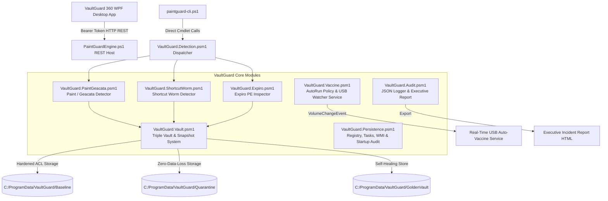

# 🛡️ VaultGuard 360 Antivirus & Vaccine Suite
*Created by Klyvex Studios - Version v1.0.0*

[](LICENSE)
[](#architecture-overview)
[](#architecture-overview)
[](#-native-desktop-application--installer-build-guide)
[](#architecture-overview)

**VaultGuard 360** (v1.0.0) is a complete, enterprise-grade incident response, clean-file integrity vault, self-protecting immunity engine, and multi-family antivirus suite engineered by **Klyvex Studios** to neutralize removable media malware and PE file infectors.

---

### 🌟 Complete Feature Matrix

- **Native WPF Desktop Application (`VaultGuard360.exe`)**: Modern .NET 8 WPF application featuring custom frameless dark window aesthetics, integrated Minimize (`—`) & Close (`✕`) title bar controls, smooth window dragging (`DragMove()`), and dynamic `WorkArea` display boundary bounds.
- **Single-File In-Memory Binary Bundling**: Built with .NET 8 `PublishSingleFile=true` and native library extraction into memory—zero loose `.dll` files scattered in your installation folder.
- **Custom Single-File WPF Installer & Uninstaller (`VaultGuard360_Setup.exe` & `Uninstall.exe`)**:
  - Self-contained custom WPF wizard installer.
  - Automatically extracts a dedicated `Uninstall.exe` binary into `C:\Program Files\VaultGuard 360\Uninstall.exe`.
  - Complete Windows Add/Remove Programs integration (`HKLM\SOFTWARE\Microsoft\Windows\CurrentVersion\Uninstall\VaultGuard360`).
  - Real-time verbose progress logging displaying extracted paths, binary operations, and registry keys.
- **Unified `Isolate → Verify → Restore → Immunize` Lifecycle Engine**: Single-click 4-stage pipeline:
  1. *Stage 1 (Isolate)*: Quarantines threat binary & kills active RAM threads.
  2. *Stage 2 (Verify)*: Computes SHA-256 baseline and audits against Golden Vault.
  3. *Stage 3 (Restore)*: Replaces corrupted files from Golden Vault & executes native `sfc /scanfile` / `DISM`.
  4. *Stage 4 (Immunize)*: Injects USB vaccine traps & hardens AutoRun registry policies.
- **Triple-Vault Storage Architecture**:
  - **`Baseline\` Compartment**: Stores deduplicated clean binary blobs (`blobs\<SHA256>.exe`), `manifest.json`, and `vault.sig`. Supports single-click `📸 CREATE BASELINE SNAPSHOT`.
  - **`GoldenVault\` Compartment**: Houses immutable golden module templates in `C:\ProgramData\VaultGuard\Golden\` for active self-healing and binary replacement.
  - **`Quarantine\` Compartment**: Holds encrypted threat payloads (`{GUID}.bin`) and sidecar metadata (`{GUID}.json`) with Restore & Permanent Delete controls.
- **Multi-Family Antivirus Detection & Remediation**:
  1. **Paint / Geacata Family**: Twin-pair file replacement worm ($v\text{<name>} + \text{<name>}$, 844,288 B signature).
  2. **Shortcut Worm Family** (`Vobfus`, `Dorkbot`, `Gamarue`): Corroborated `desktop.ini` `SHELL32.dll,7` drive icon hijacks, `.lnk` shortcut traps, and hidden folder recovery.
  3. **Expiro PE Infector Family** (`Win32/Expiro`): PE Header structural section appender inspection with a 4-stage remediation ladder.
- **USB Watchdog & Media Immunization**: Real-time `Win32_VolumeChangeEvent` monitoring with AutoRun policy hardening (`NoDriveTypeAutoRun = 0xFF`) and FAT32/NTFS trap deployment (`autorun.inf`).
- **Persistence Auditing & Purge Engine**: Audits and purges malicious Registry `Run`/`RunOnce` keys, Startup Shortcuts, Scheduled Tasks, and WMI Event Consumers/Filters (`root\subscription`).
- **Support & Technical Feedback Channel**: Integrated support ticket interface in `SecuritySettingsView` connected directly to **`admin@highqsolidacademy.com`** (via direct API & mail client fallback).
- **Strict Bearer REST API**: Loopback REST host enforcing strict `Authorization: Bearer <token>` authentication on all `/api/` endpoints.
- **GitHub Actions Release Pipeline (`.github/workflows/release.yml`)**: Automated CI/CD pipeline triggered on code pushes to `main`/`master` and tag pushes (`v*.*.*`) that compiles single-file binaries and publishes `VaultGuard360_Setup.exe` directly to GitHub Releases.

---

## 📐 Architecture Overview



---

## 🔥 Key Security & Remediation Features

### 1. 🏰 Triple-Vault Storage Architecture
Maintains three distinct, ACL-hardened repositories under `C:\ProgramData\VaultGuard\`:
- **`Baseline\` Compartment**: Stores deduplicated clean binary blobs (`blobs\<SHA256>.exe`), `manifest.json`, and `vault.sig`. Provides byte-perfect restoration without risking PE reconstruction corruption.
- **`GoldenVault\` Compartment**: Maintains signed golden module templates for active self-healing against userland tampering.
- **`Quarantine\` Compartment**: Holds isolated threat payloads (`{GUID}.bin`) and sidecar metadata (`{GUID}.json`) recording original path, SHA-256 hash, timestamps, and detection reason.

### 2. ⚡ Unified `Isolate → Verify → Restore → Immunize` Lifecycle
Subsumes threat response into a 4-stage pipeline:
1. **Stage 1 (Isolate)**: Moves infected files to Quarantine Vault & kills active RAM processes.
2. **Stage 2 (Verify)**: Validates SHA-256 hashes against Golden Vault baseline manifests.
3. **Stage 3 (Restore)**: Replaces corrupted files from Golden Vault & executes native `sfc /scanfile` / `DISM`.
4. **Stage 4 (Immunize)**: Deploys FAT32/NTFS USB vaccine traps & hardens AutoRun registry policies.

### 3. 🪜 4-Stage Expiro Remediation Ladder
Expiro (`Win32/Expiro`) appends malicious sections to executables and encrypts relocations. VaultGuard 360 uses a 4-stage remediation ladder:
1. **Stage 1 (Kill Verified Process)**: Terminates running infected processes by CIM `ExecutablePath` + SHA-256 hash match.
2. **Stage 2 (Vault Blob Restore)**: Restores byte-perfect clean binary from `blobs\<hash>.exe` if captured in baseline.
3. **Stage 3 (SFC / DISM Execution)**: If an OS binary under `C:\Windows\System32\` is infected, quarantines payload and executes `sfc /scanfile="<path>"` / `DISM.exe`.
4. **Stage 4 (Unrecoverable Flag)**: Flags non-baseline executables for clean reinstall from original source.

### 4. 👁️ Real-Time USB Watcher & Vaccine Guard
- **Persistent Service Watcher**: Registers a `Win32_VolumeChangeEvent` event sink hosted by `Start-VaultGuardService` managed by `Start-PaintGuard.ps1`.
- **AutoRun Policy Hardening**: Configures `NoDriveTypeAutoRun = 0xFF` to block autorun execution.
- **FAT32 & NTFS Traps**: Deploys empty `autorun.inf` directory traps on FAT32 media and NTFS ACL `Deny Write`/`Deny Delete` traps.

---

## 🛠️ Build & Installation Commands

### 1. Build Custom Single-File Installer (`VaultGuard360_Setup.exe`)
Run in PowerShell:
```powershell
.\Build-Installer.ps1
```
This script compiles the core WPF application, packages `payload.zip`, compiles `VaultGuard360.Setup.csproj`, and outputs single-file `VaultGuard360_Setup.exe`.

### 2. Compile Core Application Executable (`VaultGuard360.exe`)
Run in PowerShell:
```powershell
.\Build-App.ps1
```

### 3. Run Hardening & Security Tests
Run in PowerShell:
```powershell
.\Tests\Hardening-Tests.ps1
```

---

## 🔌 Hardened REST API Reference

All REST API endpoints bind strictly to loopback (`127.0.0.1`) and require the `Authorization: Bearer <token>` header.

| Endpoint | Method | Description |
| :--- | :---: | :--- |
| `/api/status` | `GET` | Returns REST engine health, quarantine count, vaccine status, and USB watcher state |
| `/api/scan` | `POST` | Dispatches drive/share scan job (`{ Paths: ["C:\\"], ScanShare: "\\\\host\\share", DryRun: true }`) |
| `/api/jobs/{id}` | `GET` | Queries progress telemetry and scan results for job `{id}` |
| `/api/baseline/capture` | `POST` | Snapshots clean system executables into baseline vault |
| `/api/baseline/verify` | `GET` | Verifies disk files against baseline vault manifest |
| `/api/baseline/restore` | `POST` | Restores clean binary from vault via layered sequence |
| `/api/baseline/export` | `POST` | Exports baseline vault to offline USB media (`{ DestinationPath: "..." }`) |
| `/api/baseline/import` | `POST` | Imports offline baseline vault (`{ SourceVaultPath: "..." }`) |
| `/api/watchdog/start` | `POST` | Starts real-time USB `Win32_VolumeChangeEvent` watcher service |
| `/api/watchdog/stop` | `POST` | Stops USB watcher service |
| `/api/quarantine` | `POST` | Moves specified threat file to Quarantine Vault |
| `/api/quarantine/vault` | `GET` | Retrieves catalog of items in Quarantine Vault |
| `/api/quarantine/restore` | `POST` | Restores quarantined item from vault by `{ QuarantineId: "..." }` |
| `/api/quarantine/purge` | `POST` | Permanently purges payload from vault by `{ QuarantineId: "..." }` |
| `/api/persistence` | `GET` | Performs comprehensive persistence audit (Registry, Tasks, WMI, Startup) |
| `/api/persistence/repair` | `POST` | Repairs malicious registry keys, scheduled tasks, and WMI hooks |
| `/api/vaccine/enable` | `POST` | Deploys immutable ACL traps and hardens AutoRun policy |
| `/api/vaccine/disable` | `POST` | Removes vaccine directory traps |
| `/api/remediate-all` | `POST` | Executes 1-Click Multi-Family Remediation sequence |
| `/api/report/export` | `POST` | Generates self-contained Executive Incident Report `.html` file |

---

## ⚙️ Support & Feedback Channel

If you experience any UI/UX glitches, endpoint scanning bugs, or technical issues while using VaultGuard 360, please reach out to our support team directly:

- **📩 End-User Support Email:** [admin@highqsolidacademy.com](mailto:admin@highqsolidacademy.com)
- **🐛 Developer Issue Tracker:** [PaintGuard GitHub Issues](https://github.com/MAVIS-creator/PaintGuard/issues)
- **🎓 Practical Digital Training:** [High Q Solid Academy Portal](https://highqsolidacademy.com/register)

---

## 📜 License

Created by **Klyvex Studios**. Distributed under the [MIT License](LICENSE).  
For security guidelines, see [SECURITY.md](SECURITY.md).  
For contribution details, see [CONTRIBUTING.md](CONTRIBUTING.md).
